class: middle, center, title-slide

# Нейронні мережі

Лекція 1:  Вступ до глибокого навчання

  
Кочура Юрій Петрович 
[iuriy.kochura@gmail.com](mailto:iuriy.kochura@gmail.com)  
<a href="https://t.me/y_kochura">@y_kochura</a>  

---

class:  black-slide, 
background-image: url(./figures/lec1/nn.jpg)
background-size: cover

# Сьогодні

.larger-x[ 
 

🎙️ Інтелект vs штучний інтелект (ШІ)  
🎙️ Машинне навчання vs глибоке навчання   
🎙️ Iнжинiринг ознак   
🎙️ Типи навчання за характером даних  
🎙️ Революція глибокого навчання      
🎙️ Сфери застосування та успіхи ШІ  

]

---

class: blue-slide, middle, center
count: false

.larger-xx[Інтелект   vs   Штучний інтелект]

---

class: middle

# Чи може машина думати?
.grid[
.kol-2-3[
.width-90[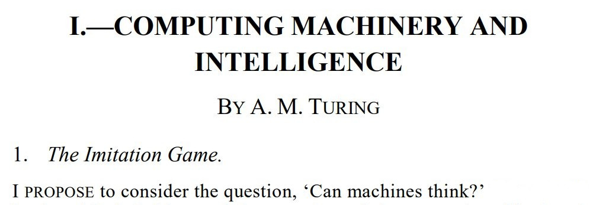]

.pull-right[&mdash; Alan Turing, 1950]
]

.kol-1-3[.center.circle.width-70[]

.center.smaller-xxx[Image source: [biography](https://www.biography.com/scientist/alan-turing)]
  ]
]

.footnote[Credits: [Alan Turing](https://academic.oup.com/mind/article/LIX/236/433/986238), 1950.]

???

Що таке свідомість?
Чи можуть машини думати?

Британський науковець Алан Тюрінг задавався питанням
чи може комп'ютер розмовляти, як людина?

Це запитання призвело до ідеї оцінки штучного інтелекту, що, як відомо, втілилося у відомому тесті Тюрінга. У 1950 році в статті "Обчислювальна техніка та інтелект" Тюрінг запропонував наступну гру.
Суддя-людина переписується з учасниками (гравцями), яких він не бачить, та оцінює їхні відповіді. Щоб пройти тест, комп'ютер повинен бути у змозі підмінити одного з учасників, не помітивши підміни. Іншими словами, комп'ютер вважатиметься розумним, якщо його розмову неможливо буде легко відрізнити від людської.

---

class: middle
count: false

.smaller-x.italic[
Намагаючись зімітувати розум дорослої людини, ми зобов’язані добре подумати про процес, який привів його до стану, в якому він перебуває. Ми можемо помітити три компоненти,

  a. Початковий стан розуму, скажімо, при народженні,

  b. Навчання, якому ми були піддані,

  c. Інший досвід, який не можна назвати навчанням, якому ми були піддані.

Замість того, щоб намагатися створити програму, яка моделює розум дорослої людини, чому б не спробувати створити таку, яка моделює розум дитини? Потім, якби це було піддано належному курсу навчання, можна було б отримати модель мозку дорослої людини. Ймовірно, дитячий мозок &mdash; це щось на зразок чистого зошита, який купуємо у канцтоварах. Досить маленький механізм і багато чистих аркушів. (Механізм і напис з нашої точки зору майже синоніми.) Ми сподіваємось, що в дитячому мозку настільки мало механізмів, що щось подібне можна легко запрограмувати.

]

.pull-right[&mdash; Алан Тюрінг, 1950]

.footnote[Credits: [Alan Turing](https://academic.oup.com/mind/article/LIX/236/433/986238), 1950.]

---

class: middle

# Що таке інтелект?

- Інтелект &mdash; це про здатність

.bold.center.larger-x[навчатися приймати рішення для досягнення цілей]
   

- Навчання, прийняття рішення, та цілі є ключовими

---

class: middle

# Що таке штучний інтелект?

- У широкому сенсі 

.bold.larger-x[Будь-яка техніка, яка дозволяє комп'ютерам імітувати поведінку людини]
   
---

class: middle

# Що таке штучний інтелект?

- У вузькому сенсі 

.alert[
.bold.larger-x[**Штучний інтелект** &mdash; здатність інженерної системи обробляти, застосовувати та вдосконалювати здобуті знання та вміння.]]

- **Знання** &mdash; це факти, інформація та навички, набуті через досвід або навчання.

.footnote[Credits: [ISO/IEC TR 24028:2020(en)](https://www.iso.org/obp/ui/#iso:std:iso-iec:tr:24028:ed-1:v1:en:term:3.4), 2020.]

---

class: middle

## Коротка історія

.center.width-90[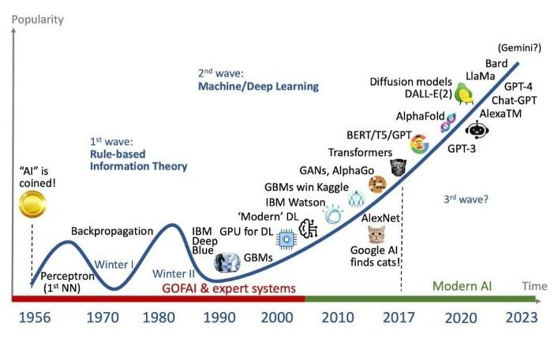] 

.footnote[Джерело зображення: [Jagruti Vekariya](https://www.linkedin.com/posts/jagrutivekariya_ai-techevolution-aiprogress-activity-7126894644767956993-CTLd/).]

---

count: false
class: middle

## Коротка історія

.grid[
.kol-2-3[

.smaller-xx[
- .bold[1940—1952: Ранні дні]
  - 1943: Мак-Каллок & Піттс: Булева модель нейрона
  - 1950: Праця Тюрінга «Обчислювальні машини і розум» 

- .bold[1952–1956:  Народження ШІ]
  - 1950s: Ранні програми ШІ, включаючи програму Семюеля для гри в шашки
  - 1956: Дартмутський семінар: запропоновано термін ''Штучний інтелект'' 

- 1956–1974: Золоті роки 
  - 1958: Френк Розенблатт винайшов [перцептрон](https://en.wikipedia.org/wiki/Perceptron) (проста нейронна мережа)
  - 1964: Програма Боброу [STUDENT] <https://en.wikipedia.org/wiki/STUDENT_(computer_program)>, яка вирішує текстові задачі з алгебри

- .bold[1974–1980: Перша зима ШІ]

- .bold[1980–1987: Бум експертних систем]
- .bold[1987—1993: Провали експертних систем: друга зима ШІ] 

- .bold[1993–2011: Статистичні підходи] 
  - Відродження ймовірнісних підходів, зосередженість на невизначеності
  - Розумні агенти

- .bold[2011– 2020: Глибоке навчання, Великі дані]
  - Великі дані, великі обчислення, нейронні мережі

- .bold[2020– по теперішній час:  Ера ШІ, сильний штучний інтелект]
  - Великі мовні моделі
]]
.kol-1-3[.middle.center.width-100[]]
]

.footnote[Credits: [Wikipedia - History of artificial intelligence](https://en.wikipedia.org/wiki/History_of_artificial_intelligence#Deep_learning)]

---

class: middle

# ШІ &mdash; багата галузь

.center.width-100[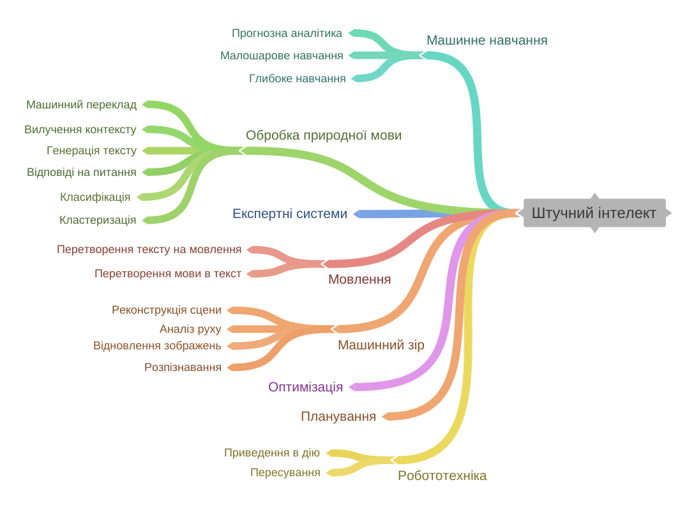]

???
<iframe width='853' height='500' src='https://embed.coggle.it/diagram/ZdD3ERcvlDArdQZF/322c4e15b7d94b552ad651d8b9732f4adc8f09816fb85e61f0001b9e3433b291' frameborder='0' allowfullscreen></iframe>

---

class: middle

.center.width-50[]

.quote["Подібно до того, як електрика змінила майже все 100 років тому, сьогодні мені важко уявити галузь, яку, на мою думку, ШІ не змінить у найближчі кілька років."]

.pull-right[&mdash; Ендрю Ин, 2017]

.footnote[Credits: [Andrew Ng: Artificial Intelligence is the New Electricity](https://www.youtube.com/watch?v=21EiKfQYZXc), 2017.]

---

class: blue-slide, middle, center
count: false

.larger-xx[Машинне навчання]

---

class: middle, center

# Що таке машинне навчання?

---

class: middle

# Визначення за Артур Семюель

.center[
.width-100[]
]

---

class: middle

# Визначення за Том Мітчелл

Том Мітчелл (1998): Комп’ютерна програма, яка учиться з досвiду **E** по вiдношенню до деякого
класу задач **T** та мiри продуктивностi **P** називається машинним навчанням, якщо її продуктивнiсть у задачах
з **T**, що вимiрюється за допомогою **P**, покращується з досвiдом **E**.

.right[
.width-30[]
]

  - Досвід (дані): ігри в які грає програма сама з собою
  - Вимір продуктивності: коефіцієнт виграшу

---

class: middle

# Класичне програмування vs машинне навчання

.center[
.width-100[]
]

???

Комп’ютери та обчислення допомагають нам досягати бiльш складних цiлей i кращих результатiв у вирiшеннi
проблем, нiж ми могли б досягти самi. Однак, багато сучасних завдань вийшли за рамки обчислень через один
основний обмежуючий фактор: традицiйно, комп’ютери можуть дотримуватися лише конкретних
вказiвок/iнструкцiй, якi їм дають.

Вирiшення проблем з програмування вимагає написання конкретних покрокових iнструкцiй, якi має виконувати комп’ютер. Ми називаємо цi кроки алгоритмами. У цьому випадку, комп’ютери можуть допомогти нам
там, де ми:
1. Розумiємо як вирiшити проблему.
2. Можемо описати проблему за допомогою чiтких покрокових iнструкцiй, якi комп’ютер може зрозумiти.

---

class: middle
count: false

# Класичне програмування vs машинне навчання

.center[
.width-100[]
]

???

Методи машинного навчання дозволяють комп’ютерам “учитися” на прикладах. Вирiшення проблем iз застосуванням машинного навчання вимагає виявлення деякого шаблону, а потiм, коли такий шаблон готовий, дозволяють, наприклад, нейроннiй мережi вивчити карту переходiв мiж вхiдними та вихiдними даними. Ця особливiсть вiдкриває новi типи проблем, де комп’ютери можуть допомогти нам у їх розв’язаннi, за умови, коли ми:
1. Визначили шаблон проблеми.
2. Маємо достатньо даних, що iлюструють шаблон.

---

class: 

background-image: url(figures/lec1/ai-ua.png)
background-size: contain

# Місце нейронних мереж

---

class: middle

.center[
.width-45[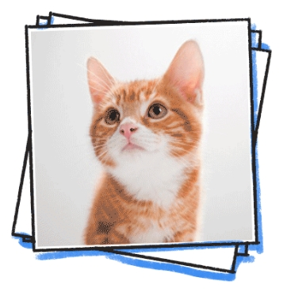] &nbsp; &nbsp;
.width-45[]
]

.question[Чи могли б ви написати комп’ютерну програму, яка розпізнає *котів* від *собак*?]

---

class: middle

.center.width-60[]

---

count: false
class: middle

.center.width-60[]

---

count: false
class: black-slide, middle
background-image: url(figures/lec1/cat3.png)
background-size: cover

---

count: false
class: black-slide, middle

background-image: url(figures/lec1/cat4.png)
background-size: cover

---

count: false
class: middle

background-image: url(figures/lec1/cats.jpg)
background-size: contain

---

count: false
class: middle

background-image: url(figures/lec1/dogs.jpeg) 
background-size: contain

---

class: middle

Для пошуку шаблону в даних (витягування семантичної інформації, ознак) потрібна побудова **складних моделей**, які б отримати вручну було б дуже складно.

Однак, можна використати алгоритм машинного навчання, який буде **вчитись** знаходити шаблон у даних самостійно. 

---

class: blue-slide, middle, center
count: false

.larger-xx[Iнжинiринг ознак]

---

class: middle 

background-image: url(figures/lec1/ml-vs-dl.png) 
background-size: contain

???
Ознака (фiча) – це окрема властивiсть чи характеристика у даних, вiд якої безпосередньо залежить вихiдний результат передбачення моделi.

Iнжинiринг (конструювання) ознак є дуже важливим етапом для створення моделi. Вiн передбачає видобування та вибiр ознак. Пiд час видобування ознак витягуються з даних усi ознаки, якi характеризують поставлену задачу. Пiд час вибору – визначаються усi найбiльш важливi ознаки з метою покращення продуктивнiсть моделi.

На рисунку  розглянуто приклад класифiкацiї зображень. Ручне вилучення ознак з даних вимагає глибоких знань як задачi, яка вирiшується, так i предметної галузi. Крiм того, цей спосiб є трудомiстким. Ми можемо автоматизувати процес конструювання ознак за допомогою глибинного навчання!

---

class: middle

.center.width-100[]

.center[Підхід глибокого навчання]

---

class: middle

.center.width-100[]

---

class: blue-slide, middle, center
count: false

.larger-xx[Типи навчання]

---

class: middle

# Типи навчання

За характером навчальних даних (**досвiду**) машинне навчання подiляють на чотири типи: контрольоване (з учителем), напiвконтрольоване, неконтрольоване (без учителя) та з пiдкрiпленням.

.center[
.width-100[]
]

---

class: middle
count: false

# Типи навчання

.center[
.width-100[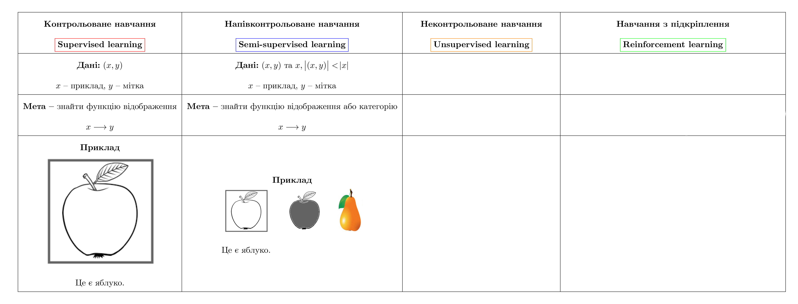]
]

---

class: middle
count: false

# Типи навчання

.center[
.width-100[]
]

---

class: middle
count: false

# Типи навчання

.center[
.width-100[]
]

---

class: blue-slide, middle, center
count: false

.larger-xx[Революція глибокого навчання]

---

class: middle

Глибоке навчання .bold[масштабує] статистичні підходи та підходи машинного навчання за допомогою
- використання більших моделей, відомих як нейронні мережі,
- навчання на великих наборах даних,
- використовуючи більше обчислювальних ресурсів.

.grid[
.kol-3-4.width-70.center[]
.kol-1-4.width-90.center[ ]
]

???

Розширення підходів статистичного та машинного навчання за допомогою грубої сили в цих трьох вимірах стало ключовим фактором успіху глибокого навчання.

---

class: middle

Спеціалізовані нейронні мережі можна навчити досягати надлюдської продуктивності в багатьох складних завданнях, які раніше вважалися недосяжними для машин.

.width-100[]
.center[Розуміння сцени, оцінка пози, геометричне місце точок]

.width-100[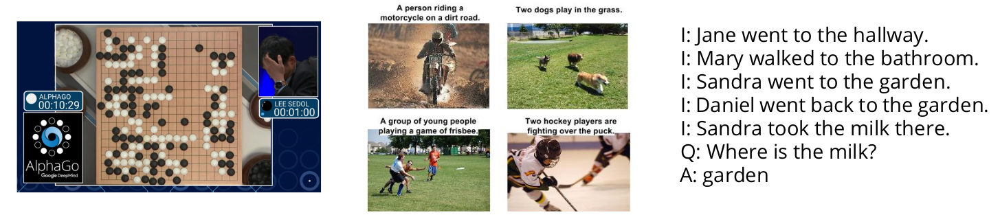]
.center[Планування, підписи до зображень, відповіді на запитання]

.footnote[Credits: François Fleuret, 2023.]

???
Дотримуючись цього підходу, глибоке навчання успішно виконує завдання, які раніше вважалися складними для комп’ютерів, наприклад розуміння зображень, мови чи тексту.

Зокрема, спеціалізовані нейронні мережі можна навчити вирішувати різноманітні проблеми, від розуміння сцени до визначення геометричного місця точок, від планування до відповідей на запитання.

---

class: middle

# Як вчиться людина?

- Ми та інші розумні істоти, вчимось завдяки **взаємодії із своїм оточенням**

- Взаємодії часто бувають **послідовними** - майбутні взаємодії можуть залежати від попередніх

- Ми направлені на **результат**

- Ми можемо вчитися **не маючи прикладів** оптимальної поведінки

???

Нейронні мережі, прекрасна біологічно натхненна парадигма програмування, яка дозволяє комп’ютеру навчатися на основі даних спостережень

---

class: middle

# Мозок людини

Базовою обчислювальною одиницею мозку є нейрон. Мозок дорослої людини складається з $86$ мiльярдiв нейронiв, якi з’єднанi між собою приблизно
$10^{14}$ − $10^{15}$ синапсами.

.footnote[Джерело: [F. A. Azevedo та ін.](https://onlinelibrary.wiley.com/doi/abs/10.1002/cne.21974), 2009.]

---

class: middle

# Біологічний та штучний нейрон

.center[
.width-100[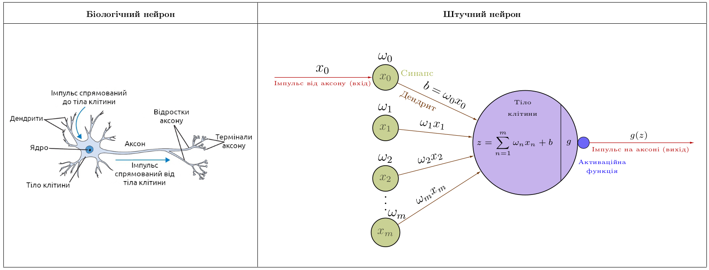]
]

---

class: middle,
# Деякі функції активації

.center[
.width-100[]
]

---

class: middle

# Людина добре сприймати візуальну інформацію

---

class: middle, center

.width-100[]

Що Ви бачите?

???

.italic[Як Ви це робите?]

---

class: middle

.center[
.width-70[]

Собака-вівця чи швабра?
]

---

class: middle

.center[
.width-70[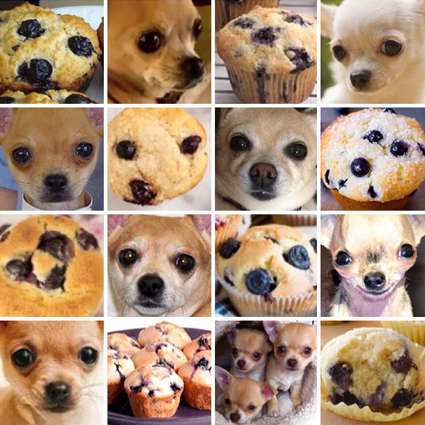]

Кекс чи собака?
]

---

class: middle

Людський мозок настільки добре інтерпретує візуальну інформацію, що **розрив** між зображенням та його семантичною інтерпретацією (пікселями) важко оцінити інтуїтивно: 

 
.center[

Це мухомор.
]

---

class: middle, center

.width-70[]

Це мухомор.

---

class: middle, center

.width-30[] +
.width-30[] +
.width-30[]

Це мухомор.

---

class: middle, center

.width-80[]

Це мухомор.

---

class: middle

## Типовий робочий процес глибокого навчання

1. Постановка проблеми + збір даних
1. Анотація даних
1. Використання даних
  - завантаження даних 
  - попередня обробка за допомогою NumPy
1. Навчання моделі
  - Створення моделі в спеціальному форматі (TF, PyTorch, Gluon)
  - Визначення функції втрат
  - Вибір алгоритму оптимізації
1. Тестування моделі
1. Розгортання моделі у додаток

---

class: middle

# Які дані використовуються?

.center.width-100[]

---

class: middle

# Ознаки у машинному навчанні

Ознаки - це спостереження, які використовуються для прийняття рішень моделлю.

- Для класифікації зображень **кожен** піксель є ознакою
- Для розпізнавання голосу, **частота** та **гучність** є ознаками
- Для безпілотних автомобілів дані з **камер**, **радарів** і **GPS** є ознаками

---

class: middle

# Типи ознак у робототехніці

- Пікселі (RGB дані)
- Глибина (сонар, лазерні далекоміри)
- Орієнтація або прискорення (гіроскоп, акселерометр, компас)

---

class: middle

# Недонавчання vs перенавчання

.center.width-100[]

---

class: middle
count: false

# Недонавчання vs перенавчання

.center.width-80[]

---

class: middle

# Що таке модель?

Хоча те, що знаходиться всерединi глибинної нейронної мережi, може бути складним, за своєю суттю це просто функцiї. Вони беруть певнi вхiднi данi: **INPUT x** i
генерують деякi вихiднi данi: **OUTPUT f(x)**

.center.width-30[]

---

# З чого складається модель?

.center.width-100[]

---

# Джерела помилок моделі

- Зсув  (Bias)
- Розкид (Variance)
- Шум (Irreducible error)

$$Err = Bias^2 + Variance + Irreducible error$$

.center.width-70[]

---

# Інтуїція

  
.center.width-60[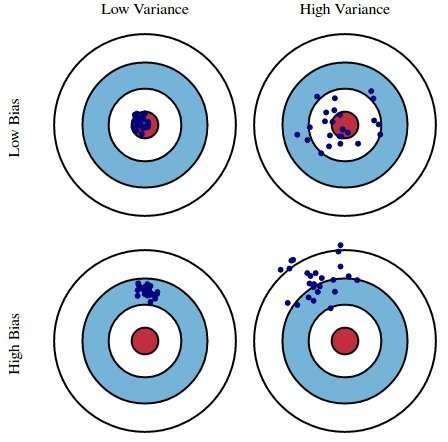]

---

# Інтуїція

## Великий зсув

  
.center.width-70[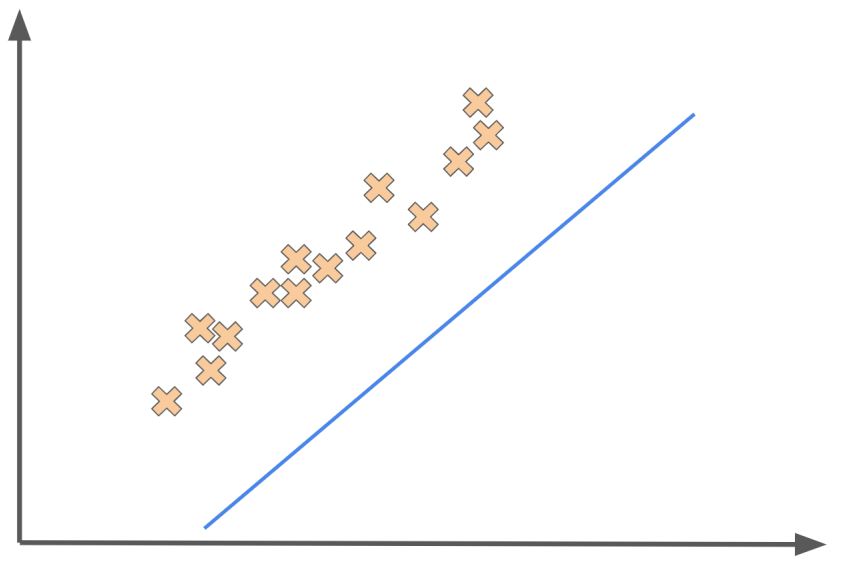]

---

class: blue-slide, middle, center
count: false

.larger-xx[Сфери застосування та успіхи ШІ]

---

class: middle, center, black-slide

<iframe width="600" height="450" src="https://www.youtube.com/embed/5kpsZoKjPgQ" frameborder="0" allowfullscreen></iframe>

Виявлення об'єктів, визначення положення людини, сегментація (2019)

---

class: middle, center, black-slide

<iframe width="600" height="450" src="https://www.youtube.com/embed/hA_-MkU0Nfw" frameborder="0" allowfullscreen></iframe>

Створення автономних автомобілів (Waymo, 2022)

---

class: middle, black-slide, center

<iframe width="600" height="450" src="https://www.youtube.com/embed/zrcxLZmOyNA" frameborder="0" allowfullscreen></iframe>

Рушій для розвитку чистої енергії (NVIDIA, 2023)

---

class: middle, black-slide, center

<iframe width="600" height="450" src="https://www.youtube.com/embed/AbdVsi1VjQY" frameborder="0" allowfullscreen></iframe>

Як ШІ розвиває медицину (Google, 2023)

---

class: middle, center

.center.width-50[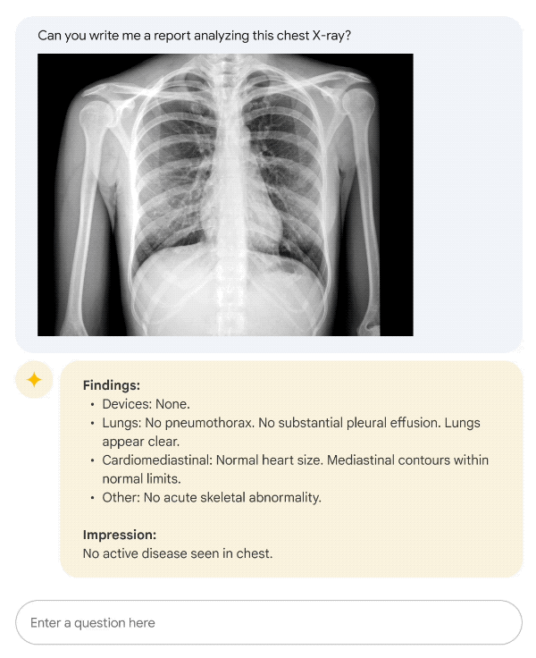]

.center[Med-PaLM 2 (Google) &mdash; це велика мовна модель, налаштована для сфери медицини. Досягає 85%+ точності для запитань у стилі експертизи медичного професійного, три-етапного іспиту (USMLE).] 

???

Що відрізняє ці системи штучного інтелекту  так це те, що вони пропонують новий інтерфейс. ШІ більше не вбудований в інструменти, а знаходять у  прямому контакті з нами, людьми.  Наприклад, Med-PaLM 2 — це велика мовна модель, налаштована для сфери медицини. З ним можна взаємодіяти за допомогою природної мови, ніби ви розмовляєте з медичним експертом. Вам не потрібно знати, як писати код або як визначати ці математичні моделі. Ви просто задаєте запитання, і ця модель надасть вам відповідь.

---

class: middle, black-slide

.center[
<video loop controls preload="auto" height="400" width="600">
  <source src="./figures/lec1/physics-simulation.mp4" type="video/mp4">
</video>

Симуляція фізики явищ (Sanchez-Gonzalez et al, 2020)

]

---

class: middle

## AlphaFold: Від послідовності амінокислот до 3D структури

.grid[
.kol-2-3.center.width-100[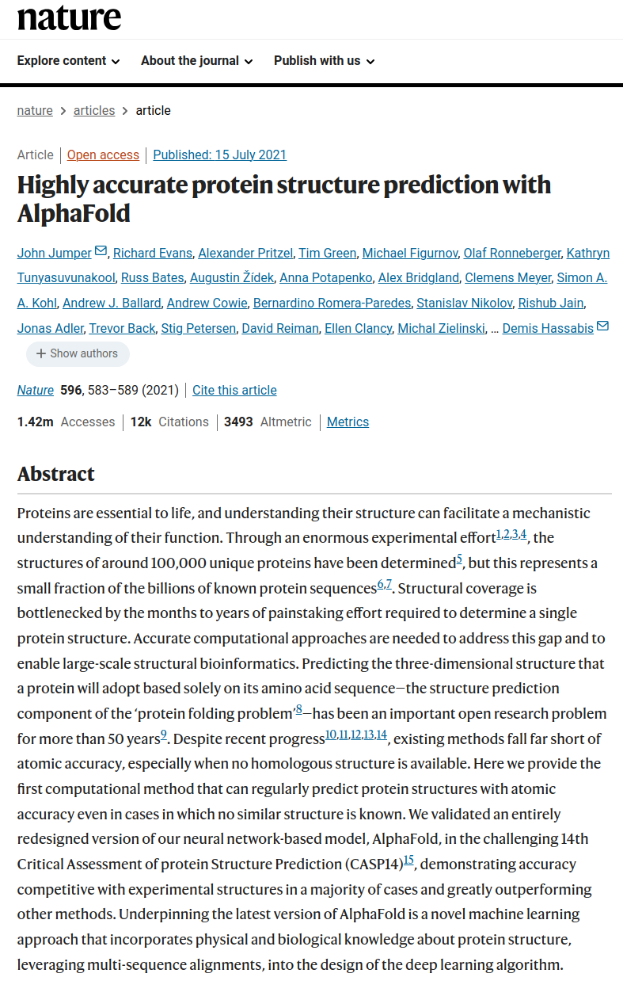]
.kol-1-3.center.width-100[]
]

???

 AlphaFold &mdash; нейронна мережа, заснована на архітектурі трансформер, яка може передбачити тривимірну структуру білка за його амінокислотною послідовністю.

Ця проблема важлива, оскільки тривимірна структура білка визначає його функцію, а розуміння функції білка є ключовим для розуміння біології та розробки нових ліків.

Однак експериментальне визначення 3D-структури білка є складним і дорогим процесом, оскільки лише для визначення однієї структури потрібно кілька місяців.

AlphaFold став проривом у цій галузі та зміг передбачити тривимірну структуру білків з високою точністю всього за пару хвилин для найдовших послідовностей.

---

class: middle, black-slide, center

<iframe width="600" height="450" src="https://www.youtube.com/embed/gg7WjuFs8F4" frameborder="0" allowfullscreen></iframe>

ШІ для науки (Deepmind, AlphaFold, 2020)

---

class: middle

## Відкриття ліків за допомогою графових нейронних мереж

.center.width-80[]

???

Використання графових нейронних мереж для відкриття нових ліків.

Відкриття нових ліків є складною та дорогою проблемою пошуку, метою якої є пошук молекул, які зв’яжуться з цільовим білком і модулюватимуть його функцію. На жаль, ця проблема складна з двох причин:
-  по-перше, простір пошуку величезний - простір усіх можливих фармакологічно активних молекул оцінюється приблизно в $10^60$ молекул.
- по-друге, зв'язування молекули з білком є складним процесом, який важко змоделювати. Лабораторні експерименти необхідні для оцінки зв’язування молекули з білком, і ці експерименти є дорогими та трудомісткими.

Графові нейронні мережі стали проривом у цій галузі, і вони змогли передбачити властивості молекул з високою точністю.

У певному сенсі вони можуть слугувати віртуальною лабораторією, яку можна використовувати для попереднього скринінгу мільйонів молекул за лічені години, таким чином зводячи лабораторну роботу лише до найперспективніших кандидатів.

---

class: middle, center, black-slide

<iframe width="600" height="450" src="https://www.youtube.com/embed/7gh6_U7Nfjs" frameborder="0" allowfullscreen></iframe>

Синтез мовлення та відповіді на питання (Google, 2018)

---

class: middle, center, black-slide

<iframe width="600" height="450" src="https://www.youtube.com/embed/kSLJriaOumA" frameborder="0" allowfullscreen></iframe>

Генерація зображень (Karras et al, 2018)

---

class: middle, center, black-slide

<iframe width="600" height="450" src="https://www.youtube.com/embed/qTgPSKKjfVg" frameborder="0" allowfullscreen></iframe>

Генерація зображень і мистецтво ШІ (OpenAI, 2022)

---

class: middle, center, black-slide

<iframe width="600" height="450" src="https://www.youtube.com/embed/J_2fIGmsoRg" frameborder="0" allowfullscreen></iframe>

Reface оживив відомі київські мурали до Дня Києва (2021)

---

class: middle, center, black-slide

<iframe width="600" height="450" src="https://www.youtube.com/embed/Zm9B-DvwOgw" frameborder="0" allowfullscreen></iframe>

Написання комп’ютерного коду (OpenAI, 2021)

---

class: middle, center, black-slide

background-image: url(figures/lec1/ChatGPT.png)
background-size: contain

        
        
   

Відповісти на всі ваші запитання (OpenAI, 2022)

---

class: middle

.center.circle.width-30[]

.quote["Протягом останніх сорока років ми програмували комп’ютери; протягом наступних сорока років ми будемо їх навчати."]

.pull-right[&mdash; Крістофер Бішоп, 2020.] 
???
Крістофер Бішоп є технічним співробітником Microsoft і директором Microsoft Research AI4Science. Він також є почесним професором комп’ютерних наук Единбурзького університету та членом Дарвінівського коледжу в Кембриджі. У 2017 році він був обраний членом Королівського товариства.

---

class: end-slide, center
count: false

.larger-xx[Кінець]

---

count: false

# Література

- Simon J.D. Prince (2024). [Understanding Deep Learning](https://udlbook.github.io/udlbook/). Chapter 1: Introduction.
