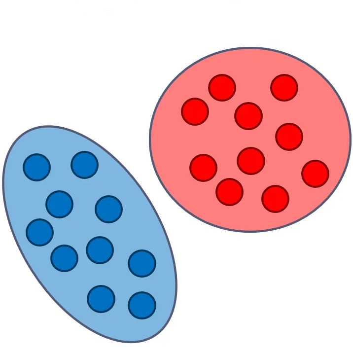
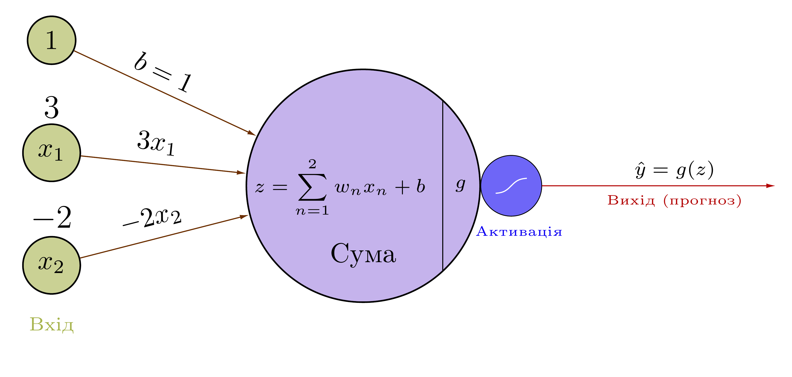
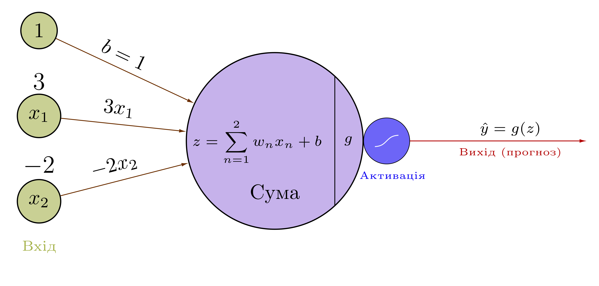
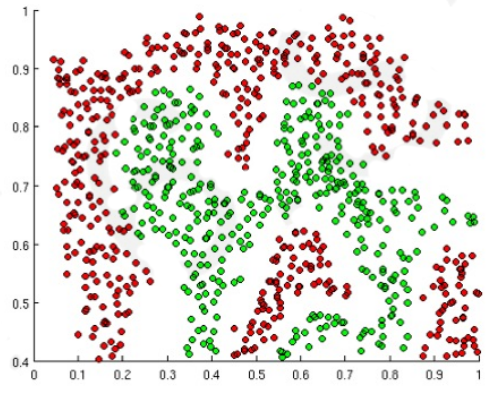
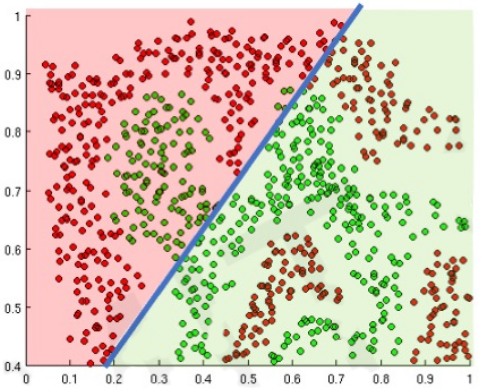
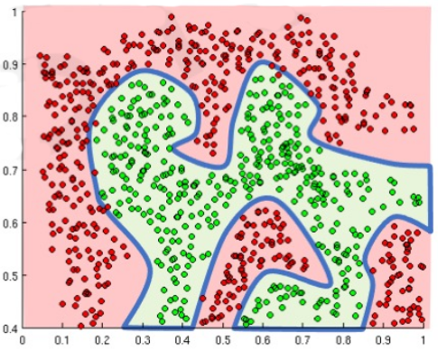

class: middle, center, title-slide

# Нейронні мережі

Лекція 2:  Багатошаровий перцептрон
  
Кочура Юрій Петрович 
[iuriy.kochura@gmail.com](mailto:iuriy.kochura@gmail.com)  
<a href="https://t.me/y_kochura">@y_kochura</a>  

---

class: middle

background-image: url(figures/lec2/ai_app2.png)
background-size: contain

---

background-image: url(figures/lec2/lego-composition.png)
background-size: contain

# Глибоке навчання як архітектурна мова

---

class: middle

# Що таке модель?

Хоча те, що знаходиться всерединi глибинної нейронної мережi, може бути складним, за своєю суттю це просто функцiї. Вони беруть певнi вхiднi данi: **INPUT x** i
генерують деякi вихiднi данi: **OUTPUT f(x)**

.center.width-30[]

---

class: middle
count: false

# Дискримінаційні vs генеративні моделі

.grid[
.kol-1-2[
.center.width-80[]
.smaller-x.center[Дискримінаційна модель]
]

.kol-1-2[ 
.center.width-75[]
.smaller-x.center[Генеративна модель]

  ]
]

.footnote[Джерело: [Generative vs. Discriminative Models](https://medium.com/ai-made-simple/generative-vs-discriminative-models-35b81f677822)]

???
Генеративні моделі це ті, які зосереджені на розподілі класів у наборі даних. По суті, генеративні моделі моделюють, як були згенеровані дані, відповідають на таке запитання:
«Яка ймовірність того, що цей або інший кластер створив цей екземпляр даних?»

Приклади генеративних моделей машинного навчання включають лінійний дискримінантний аналіз (LDA), приховані марковські моделі та байєсівські мережі, такі як наївний байєсів класифікатор.

У той час як генеративні моделі дізнаються про розподіл набору даних, дискримінаційні моделі дізнатися про межі між класами в наборі даних. Метою дискримінаційних моделей є ідентифікація межі (границі) рішень між класами. Дискримінаційна модель намагається відповісти на таке запитання: «З якого боку відносно границі прийняття рішення знаходиться цей екземпляр?»

Приклади дискримінаційних моделей у машинному навчанні включають: машина опорних векторів, дерева рішень, випадкові ліси, логістична регресія.

---

class:  black-slide, 
background-image: url(./figures/lec1/nn.jpg)
background-size: cover

# Сьогодні

.larger-x[ 
 

🎙️ Одношарова нейронна мережа: пряме поширення  
🎙️ Одновимірний градієнтний спуск   
🎙️ Одношарова нейронна мережа: зворотне поширення   
🎙️ Перцептрон з кількома виходами  
🎙️ Багатошаровий перцептрон       

]

---

class: blue-slide, middle, center
count: false

.larger-xx[Перцептрон]

Одношарова нейронна мережа: пряме поширення

Модель одного штучного нейрона

Перцептрон vs Логістична регресія

---

# Перцептрон

Перцептрон (Френк Розенблат, 1957)

$$g(z) = \begin{cases}
   1 &\text{if } z =\sum_i w_i x_i + b \geq 0  \\\\
   0 &\text{else}
\end{cases}$$

Ця модель спочатку була мотивована біологією, де $w_i$ &mdash; це синаптичні ваги для вхідних сигналів $x_i$ та  $g$ активація.
.grid[
.kol-2-3[
.width-90[]
]

.kol-1-3[.center.circle.width-90[]

.center.smaller-x[Ф. Розенблатт ]

.center.smaller-xxx[Джерело: [The Gradient](https://thegradient.pub/towards-geometric-deep-learning/)]
  ]
]

.footnote[Джерело: Frank Rosenblatt, [Mark I Perceptron operators' manual](https://apps.dtic.mil/sti/pdfs/AD0236965.pdf), 1960.]

???

У 1957 році Френк Розенблатт винайшов персептрон, або Mark I, у Корнельському університеті. Завершений у 1960 році, це був перший комп’ютер, який міг вивчати нові навички методом проб і помилок, використовуючи тип нейронної мережі, яка симулювала процеси мислення людини.

Френк Розенблатт не тільки поєднав лінійні НМ і порогові функції, але також відкрид дорогу для створення глибоких багатошарових перцептронів (MLP). Його MLP мали перший шар, що не навчався, з випадковими ваги та адаптивний вихідний шар. Хоча це ще не було глибоким навчанням, оскільки навчався лише останній шар, Розенблатт фактично мав те, що набагато пізніше було названо як Маши́ни екстрема́льного навча́ння без належної атрибуції.

MLP також обговорювалися в 1961 році Карлом Стейнбухом та Роджером Девідом Джозефом (1961). 

Розенблат (1962) навіть писав про «помилки зворотного поширення» в MLP із прихованим шаром, хоча він ще не мав загального алгоритму глибокого навчання для глибоких MLP. Те, що зараз називається зворотним поширенням, є зовсім іншим і вперше було опубліковано в 1970 році.

Сьогодні найпопулярнішим FNN є версія (магістральна мережа) Highway Net на основі LSTM (згадана нижче) під назвою ResNet, яка стала найбільш цитованою мережею у 21 столітті.

Магістра́льна мере́жа (англ. highway network) — це один з підходів до оптимізації мереж та збільшення їхньої глибини. Магістральні мережі використовують навчені вентильні механізми для регулювання інформаційного потоку, натхненного рекурентними нейронними мережами довгої короткочасної пам'яті (LSTM). Ці вентильні механізми дозволяють нейронним мережам мати шляхи для проходження інформації крізь різні шари («інформаційні магістралі», англ. "information highways").

---

background-image: url(./figures/lec2/neuron_UA.png)
background-size: contain

             
.smaller-xx[
$$
\begin{aligned}
\mathbf{X} = \begin{bmatrix}
x\_1  \\\\
x\_2  \\\\
\vdots \\\\
x\_m
\end{bmatrix} 
&&
\mathbf{W} = \begin{bmatrix}
w\_1  \\\\
w\_2  \\\\
\vdots \\\\
w\_m
\end{bmatrix}
&& 
\mathbf{X}^T = \begin{bmatrix}
x\_1 & x\_2 & \cdots & x\_m
\end{bmatrix} 
\end{aligned}$$

$$\begin{aligned}z &= \sum\_{n=1}^{m} w\_n x\_n + b = \mathbf{X}^T \cdot \mathbf{W} + b = \mathbf{W}^T \cdot \mathbf{X} + b \\\\
\hat y &= g(z) \\\\
J(\hat y, y) &= - \frac{1}{n} \sum\_{i=1}^{n} \big(y^{(i)} \log(\hat y^{(i)}) + (1- y^{(i)}) \log(1 -\hat y^{(i)}) \big)
\end{aligned}$$

]

---

background-image: url(./figures/lec2/neuron_UA.png)
background-size: contain

             
.smaller-x[

.center[*Пряме поширення*]

$$\boxed{\begin{aligned}z &= \sum\_{n=1}^{m} w\_n x\_n + b = \mathbf{X}^T \cdot \mathbf{W} + b = \mathbf{W}^T \cdot \mathbf{X} + b \\\\
\hat y &= g(z) \\\\
J(\hat y, y) &= - \frac{1}{n} \sum\_{i=1}^{n} \big(y^{(i)} \log(\hat y^{(i)}) + (1- y^{(i)}) \log(1 -\hat y^{(i)}) \big)
\end{aligned}}$$

]

---

class: middle

##  Перцептрон: приклад обчислень

Припустимо $m = 3$

$$
\begin{aligned}
\mathbf{X} = \begin{bmatrix}
x\_1  \\\\
x\_2  \\\\
x\_3
\end{bmatrix} = \begin{bmatrix}
-0.1  \\\\
0.7  \\\\
0.5
\end{bmatrix} 
&&
\mathbf{W} = \begin{bmatrix}
w\_1  \\\\
w\_2  \\\\
w\_3
\end{bmatrix} =
\begin{bmatrix}
1  \\\\
-2  \\\\
2
\end{bmatrix}
&&
b = 0.8
\end{aligned}$$

$$\boxed{\begin{aligned}
z = \sum_{n=1}^{3} w_n x_n + b &= w_1 x_1 + w_2 x_2 + w_3 x_3 + b = \\\\
&= 1 \cdot -0.1 + -2 \cdot 0.7 + 2 \cdot 0.5 + 0.8 = 0.3
\end{aligned}}$$

---

class: middle
count: false

##  Перцептрон: приклад обчислень

Припустимо $m = 3$

$$
\begin{aligned}
\mathbf{X} = \begin{bmatrix}
x\_1  \\\\
x\_2  \\\\
x\_3
\end{bmatrix} = \begin{bmatrix}
-0.1  \\\\
0.7  \\\\
0.5
\end{bmatrix} 
&&
\mathbf{W} = \begin{bmatrix}
w\_1  \\\\
w\_2  \\\\
w\_3
\end{bmatrix} =
\begin{bmatrix}
1  \\\\
-2  \\\\
2
\end{bmatrix}
&&
b = 0.8
\end{aligned}$$

$$\color{lightgray} \boxed{\begin{aligned}
z = \sum_{n=1}^{3} w_n x_n + b &= w_1 x_1 + w_2 x_2 + w_3 x_3 + b = \\\\
&= 1 \cdot -0.1 + -2 \cdot 0.7 + 2 \cdot 0.5 + 0.8 = 0.3
\end{aligned}}$$

$$\boxed{\begin{aligned}
z = \mathbf{X}^T \cdot \mathbf{W} + b &= \begin{bmatrix}
x\_1 & x\_2 &  x\_3 
\end{bmatrix} \begin{bmatrix}
w\_1  \\\\
w\_2  \\\\
w\_3
\end{bmatrix} + b = \\\\
&= w_1 x_1 + w_2 x_2 + w_3 x_3 + b = 0.3
\end{aligned}}$$

$$\hat y  = g(z) = g(\mathbf{X}^T \cdot \mathbf{W} + b) = \frac{1}{1 + \exp(-z)} = \frac{1}{1 + \exp(-0.3)} \approx 0.57 $$

---

class: middle, center

# Перцептрон: приклад 2
<!-- .grid[
.kol-2-3[
.width-100[]
]

.smaller-x.kol-1-3[ Нехай маємо: $b = 1$ та $\mathbf{W} = \begin{bmatrix} -1 \\\\ 2 \end{bmatrix}$

  ]
] -->

.width-80[]

.grid[
.kol-1-2[
Нехай маємо: $b = 1$ та $\mathbf{W} = \begin{bmatrix} 3 \\\\ -2 \end{bmatrix}$
]

.kol-1-2[ 
$$
\boxed{\begin{aligned}
\hat y  &= g(\mathbf{X}^T \cdot \mathbf{W} + b) = \\\\
&= g \biggl(\begin{bmatrix} x\_1 \\\\ x\_2 \end{bmatrix}^T \cdot  \begin{bmatrix} 3 \\\\ -2 \end{bmatrix} + 1\biggr) = \\\\
&= g(\underbrace{3x\_1 - 2x\_2 + 1}\_{\text{\color{red}line in 2D}})
\end{aligned}}$$

  ]
] 

---

background-image: url(./figures/lec2/neuron-2Dexample2.png)
background-size: contain

<!-- # Перцептрон: приклад  -->
 
.grid[
.kol-2-3[
.width-75[]
$\begin{aligned}
\hat y  = g(3x\_1 - 2x\_2 + 1)
\end{aligned}$

]

.kol-1-3[ 

  ]
]

---

background-image: url(./figures/lec2/neuron-2Dexample-point.png)
background-size: contain

<!-- # Перцептрон: приклад  -->
 
.grid[
.kol-2-3[
.width-75[]
$\begin{aligned}
\hat y  = g(3x\_1 - 2x\_2 + 1)
\end{aligned}$

 
Припустимо: $\mathbf{X} = \begin{bmatrix} 2 \\\\   -1 \end{bmatrix}$

$\begin{aligned}
\hat y  &= g((3\*2) - (2\*-1) + 1) = \\\\
&= g(9) \approx 0.999
\end{aligned}$

]

.kol-1-3[ 

  ]
]

---

background-image: url(./figures/lec2/neuron-2Dexample-line.png)
background-size: contain

   
.grid[
.kol-2-3[
.width-75[]
<!-- $\begin{aligned}
\hat y  = g(3x\_1 - 2x\_2 + 1)
\end{aligned}$ -->

]

.kol-1-3[ 

  ]
]

---

class: middle,
# Деякі функції активації

.center[
.width-100[]
]

---

class: middle,
# Важливість функцій активації

Призначення функцій активації &mdash; введення нелінійності

.center[
.width-40[]
]

Припустимо, ми хочемо створити таку нейронну мережу, яка зможе розрізняти червоні від зелених прикладів

---

class: middle,
# Важливість функцій активації

Призначення функцій активації &mdash; введення нелінійності

.grid[
.kol-1-2[
.center.width-75[]
.smaller-x.center[Нейрони з лінійними функціями активації породжують лінійну криву рішень, не має значення розмір мережі (глибина, ширина)]
]

.kol-1-2[ 

  ]
]

---

class: middle,
# Важливість функцій активації

Призначення функцій активації &mdash; введення нелінійності

.grid[
.kol-1-2[
.center.width-75[]
.inactive.smaller-x.center[Нейрони з лінійними функціями активації породжують лінійну криву рішень, не має значення розмір мережі (глибина, ширина)]
]

.kol-1-2[ 
.center.width-75[]
.smaller-x.center[Нейрони з нелінійними функціями активації дозволяють нам апроксимувати криву рішень будь-якої складності]

  ]
]

---

class: blue-slide, middle, center
count: false

.larger-xx[Одновимірний градієнтний спуск]

---

class: middle

# Одновимірний градієнтний спуск
.smaller-x[

Розглянемо деяку монотонну неперервну диференційовану функцію $f: \mathbb{R} \rightarrow \mathbb{R}$. Розкладаючи у ряд Тейлора, ми отримуємо:

$$f(x + \varepsilon) = f(x) + \varepsilon f^{'}(x) + \mathcal{O}(\varepsilon^2)$$

Зфіксуємо розмір кроку $\alpha > 0$ та оберемо $\varepsilon = -\alpha f^{'}(x)$. Підставляючи це у ряд Тейлора, отримаємо:

$$f(x -\alpha f^{'}(x)) = f(x) - \alpha f^{'2}(x)  + \mathcal{O}(\alpha^2 f^{'2}(x))$$

Якщо похідна $f^{'}(x) \neq 0$ не зникає ми робимо прогрес так як $\alpha f^{'2}(x) > 0$. Крім того, ми завжди можемо вибрати $\alpha$ досить малим, щоб вирази вищих порядків стали нерелевантними. Тому ми приходимо до

$$f(x -\alpha f^{'}(x)) \lessapprox f(x)$$

Це означає, якщо ми використовуємо

$$x \leftarrow x -\alpha f^{'}(x)$$

для ітерації по $x$, значення функції  $f(x)$  може зменшитись. 
]

???

Монотонна функція – це функція, яка завжди зростає чи завжди зменшується на певному інтервалі значень.

Одновимірний градієнтний спуск є чудовим прикладом для пояснення того, чому алгоритм градієнтного спуску може зменшити значення цільової функції.

Ряд Тейлора використовується для опису того, як виглядає функція в околі деякої точки $x$.

Тобто в першому порядку наближення $f(x + \varepsilon)$ визначається значенням функції $f(x)$ і першою похідною $f^{'}(x)$ в точці $x$. Цілком логічно припустити, що для невеликих $\varepsilon$, що рухаються в напрямку негативного градієнта, буде зменшуватися $f$. 

Тому під час градієнтного спуску ми спочатку вибираємо початкове значення $x$ і константу $\alpha > 0$, а потім використовуємо їх для безперервної ітерації $x$ до досягнення умови зупинки, наприклад, коли величина градієнта $ |f^{'}(x)|$ достатньо малий або кількість ітерацій досягла певного значення.

---

background-image: url(./figures/lec2/gdC.png)
background-size: contain

???

Для простоти ми вибираємо цільову функцію $f(x) = x^2$, щоб проілюструвати, як реалізувати градієнтний спуск. Хоча ми знаємо, що $x = 0$ є рішенням для мінімізації $f(x)$, ми все ще використовуємо цю просту функцію, щоб спостерігати, як змінюється $x$.

---

background-image: url(figures/lec2/gd025.png)
background-size: contain

???
Хід оптимізації за параметром $x$

---

background-image: url(figures/lec2/gd006.png)
background-size: contain

???
Якщо ми використовуємо надто малу швидкість навчання, $x$ оновлюватиметься дуже повільно, що потребуватиме більше ітерацій, щоб отримати краще рішення.

---

background-image: url(figures/lec2/gd1.1.png)
background-size: contain

???
якщо ми використовуємо надмірно високу швидкість навчання, $|\alpha f^{'}(x)|$ може бути занадто великим для формули розкладання Тейлора першого порядку. Тобто доданок $\mathcal{O}(\alpha^2 f^{'2}(x))$ може стати значущим. У цьому випадку ми не можемо гарантувати, що ітерація за $x$ зможе зменшити значення $f(x)$.

---

class: blue-slide, middle, center
count: false

.larger-xx[Перцептрон]

Одношарова нейронна мережа: зворотне поширення

---

class: middle

# Зворотне поширення

Правило ланцюжка стверджує, якщо у нас є складена функція $\ell(g(w))$, тоді похідна цієї функції по $w$ визначається як:
$$
\begin{aligned}
\frac{d }{d w} \ell(g(w)) &=\frac{d \ell}{d g} \frac{d g}{d w}
\end{aligned}$$

У контексті глибокого навчання:
- $\ell$ &mdash; цільова функція втрат нейронної мережі, 
- $g$ &mdash; проміжні активації на кожному шарі
- $w$ &mdash; навчальні параметри.

???
У контексті глибокого навчання $\ell(g(x))$ представляє цільову функцію втрат нейронної мережі,  $g$ представляє проміжні активації на кожному шарі, а $x$ представляє вхідні дані.

---

class: middle

# Зворотне поширення

- Оскільки нейронна мережа є **композицією диференційованих функцій**, загальні похідні втрат можна оцінити зворотно, застосовуючи рекурсивно правило ланцюжка до обчислювального графу нейронної мережі.
- Реалізація цієї процедури називається зворотним *автоматичним диференціюванням* або **зворотним поширенням**.

---

class: middle

.smaller-x[

.center[*Пряме поширення*]

$$\boxed{\begin{aligned}z &= \sum\_{n=1}^{m} w\_n x\_n + b = \mathbf{X}^T \cdot \mathbf{W} + b = \mathbf{W}^T \cdot \mathbf{X} + b \\\\
\hat y &= g(z) = \sigma(z) = \frac{1}{1 + \exp(-z)} \\\\
J(\hat y, y) &= - \frac{1}{n} \sum\_{i=1}^{n} \biggl(y^{(i)} \log(\hat y^{(i)}) + (1- y^{(i)}) \log(1 -\hat y^{(i)}) \biggr)
\end{aligned}}$$

.grid[
.kol-2-3[

.center[*Зворотне поширення*]

$$\boxed{\begin{aligned}
\frac{\partial J(\hat y, y)}{\partial \hat y} &= -\frac{y}{\hat y} + \frac{1- y}{1 - \hat y} \\\\[18pt]
\frac{\partial J(\hat y, y)}{\partial z} &= \frac{\partial J(\hat y, y)}{\partial \hat y} \frac{\partial \hat y}{\partial z} = \hat y - y \\\\[18pt]
\frac{\partial J(\hat y, y)}{\partial \mathbf{W}} &= \frac{\partial J(\hat y, y)}{\partial \hat y} \frac{\partial \hat y}{\partial z} \frac{\partial z}{\partial \mathbf{W}} = \mathbf{X}^T \cdot (\hat y - y) \\\\[18pt]
\frac{\partial J(\hat y, y)}{\partial b} &=  \frac{\partial J(\hat y, y)}{\partial \hat y} \frac{\partial \hat y}{\partial z} \frac{\partial z}{\partial b} = \hat y - y
\end{aligned}}$$
]

.kol-1-3[
.center[*Оновлення параметрів*]

$$\boxed{\begin{aligned}
\mathbf{W} &= \mathbf{W} - \alpha \frac{\partial J(\hat y, y)}{\partial \mathbf{W}} \\\\[18pt]
b &= b - \alpha \frac{\partial J(\hat y, y)}{\partial b}
\end{aligned}}$$
]]
]

---

class: blue-slide, middle, center
count: false

.larger-xx[Перцептрон з кількома виходами]

---

class: middle

.smaller-x[Оскільки всі входи щільно з’єднані з усіма виходами, ці шари називаються щільними (*Dense*) або повнозв'язними]

.center[
.width-70[]
]

$$z\_j = \sum\_{n=1}^{m} w\_{j, n} x\_n  + b\_j$$

---

class: middle
count: false

##  Приклад обчислень

.center[
.width-50[]
]

$\begin{aligned}
\mathbf{X}^{m \times 1} = \begin{bmatrix}
x\_1  \\\\
x\_2  \\\\
\vdots \\\\
x\_m
\end{bmatrix} 
\end{aligned}$

---

class: middle
count: false

##  Приклад обчислень

.center[
.width-50[]
]

$\begin{aligned}
\mathbf{X}^{m \times 1} = \begin{bmatrix}
x\_1  \\\\
x\_2  \\\\
\vdots \\\\
x\_m
\end{bmatrix} 
&&
\mathbf{W}^{3 \times m} = \begin{bmatrix}
w\_{11} & w\_{12} &  \cdots & w\_{1m} \\\\
w\_{21} & w\_{22} & \cdots & w\_{2m} \\\\
w\_{31} & w\_{32} & \cdots & w\_{3m}
\end{bmatrix}
\end{aligned}$

---

class: middle
count: false

##  Приклад обчислень

.center[
.width-50[]
]

$\begin{aligned}
\mathbf{X}^{m \times 1} = \begin{bmatrix}
x\_1  \\\\
x\_2  \\\\
\vdots \\\\
x\_m
\end{bmatrix} 
&&
\mathbf{W}^{3 \times m} = \begin{bmatrix}
w\_{11} & w\_{12} &  \cdots & w\_{1m} \\\\
w\_{21} & w\_{22} & \cdots & w\_{2m} \\\\
w\_{31} & w\_{32} & \cdots & w\_{3m}
\end{bmatrix}
&& 
\mathbf{b}^{3 \times 1} = \begin{bmatrix}
b\_1 \\\\
b\_2 \\\\
b\_3
\end{bmatrix}
\end{aligned}$

---

class: middle

##  Приклад обчислень

.center[
.width-50[]
]
.smaller-xx[
$$\begin{aligned}
\mathbf{X}^{m \times 1} = \begin{bmatrix}
x\_1  \\\\
x\_2  \\\\
\vdots \\\\
x\_m
\end{bmatrix} 
&&
\mathbf{W}^{3 \times m} = \begin{bmatrix}
w\_{11} & w\_{12} &  \cdots & w\_{1m} \\\\
w\_{21} & w\_{22} & \cdots & w\_{2m} \\\\
w\_{31} & w\_{32} & \cdots & w\_{3m}
\end{bmatrix}
&& 
\mathbf{b}^{3 \times 1} = \begin{bmatrix}
b\_1 \\\\
b\_2 \\\\
b\_3
\end{bmatrix}
\end{aligned}$$

$$\boxed{\begin{aligned}
\mathbf{z} =  \mathbf{W} \cdot \mathbf{X} + \mathbf{b} 
&= \begin{bmatrix}
w\_{11} & w\_{12} &  \cdots & w\_{1m} \\\\
w\_{21} & w\_{22} & \cdots & w\_{2m} \\\\
w\_{31} & w\_{32} & \cdots & w\_{3m}
\end{bmatrix} \cdot
\begin{bmatrix}
x\_1  \\\\
x\_2  \\\\
\vdots \\\\
x\_m
\end{bmatrix} + 
\begin{bmatrix}
b\_1 \\\\
b\_2 \\\\
b\_3
\end{bmatrix} = \\\\
&= 
\begin{bmatrix}
w\_{11} x\_1 + w\_{12} x\_2 +  \cdots + w\_{1m} x\_m + b\_1 \\\\
w\_{21} x\_1 + w\_{22} x\_2 +  \cdots + w\_{2m} x\_m + b\_2 \\\\
w\_{31} x\_1 + w\_{32} x\_2 +  \cdots + w\_{3m} x\_m + b\_3 
\end{bmatrix} = \begin{bmatrix}
z\_1 \\\\
z\_2 \\\\
z\_3
\end{bmatrix}
\end{aligned}}$$

]

---

class: middle, black-slide

background-image: url(figures/lec2/dense.png)
background-size: contain

.footnote[Джерело: [MIT 6.S191](http://introtodeeplearning.com/)]

---

class: middle

background-image: url(figures/lec2/multiOuptupTF.png)
background-size: contain

# Приклад реалізації в TF 

              
$$z\_j = \sum\_{n=1}^{m} w\_{j, n} x\_n  + b\_j$$ 

.footnote[Детальніше: [Dense layer](https://keras.io/api/layers/core_layers/dense/)]

---

class: blue-slide, middle, center
count: false

.larger-xx[Багатошаровий перцептрон]

---

class: middle

# Один прихований шар

.center[
.width-100[]
]

---

class: middle
count: false

# Один прихований шар

.center[
.width-100[]
]

---

class: middle

##  Один прихований шар

.center[
.width-60[]
]

.smaller-xx[
$$\begin{aligned}
\mathbf{X} = \begin{bmatrix}
x\_1  \\\\
x\_2  \\\\
x\_3
\end{bmatrix} 
&&
\mathbf{W}^{[1]} = \begin{bmatrix}
w\_{11} & w\_{12} &  w\_{13} \\\\
w\_{21} & w\_{22} &  w\_{23} \\\\
w\_{31} & w\_{32} &  w\_{33} \\\\
w\_{41} & w\_{42} &  w\_{43}
\end{bmatrix}
&& 
\mathbf{b}^{[1]} = \begin{bmatrix}
b\_1 \\\\
b\_2 \\\\
b\_3 \\\\
b\_4
\end{bmatrix}
&&
\mathbf{W}^{[2]} = \begin{bmatrix}
w\_{1} & w\_{2} &  w\_{3} & w\_{4} 
\end{bmatrix}
&& 
b^{[2]} = b
\end{aligned}$$

$$\boxed{\begin{aligned}
\mathbf{z}^{[1]} &= \mathbf{W}^{[1]} \cdot \mathbf{X} + \mathbf{b}^{[1]} \\\\
\mathbf{a}^{[1]} &= g^{[1]}(\mathbf{z}^{[1]}) \\\\
z^{[2]} &= \mathbf{W}^{[2]} \cdot \mathbf{a}^{[1]} + b^{[2]} \\\\
\hat y &= a^{[2]} = g^{[2]}(z^{[2]})
\end{aligned}}$$
]

---

class: middle

# Глибока нейронна мережа

.center[
.width-100[]
]

---

class: middle

## Як навчити свою нейронну мережу?

.grid[
.kol-1-5[
.center.width-100[]
.bold.smaller-x.center[Френк Розенблат]

.bold.larger-x.center[1957]

.smaller-x.center[[Правило навчання перцептрона](https://hagan.okstate.edu/4_Perceptron.pdf)]
]

.kol-1-5[ 
.center.width-100[]
.bold.smaller-x.center[Олексій Івахненко]

.bold.larger-x.center[1966]

.smaller-x.center[[Метод групового урахування аргументів](https://uk.wikipedia.org/wiki/%D0%9C%D0%B5%D1%82%D0%BE%D0%B4_%D0%B3%D1%80%D1%83%D0%BF%D0%BE%D0%B2%D0%BE%D0%B3%D0%BE_%D1%83%D1%80%D0%B0%D1%85%D1%83%D0%B2%D0%B0%D0%BD%D0%BD%D1%8F_%D0%B0%D1%80%D0%B3%D1%83%D0%BC%D0%B5%D0%BD%D1%82%D1%96%D0%B2)]
  ]

 
.kol-1-5[ 
.center.width-100[]
.bold.smaller-x.center[Сеппо Ліннайнмаа]

.bold.larger-x.center[1970]
  ]

.kol-1-5[ 
.center.width-100[]
.bold.smaller-x.center[Пол]
.bold.smaller-x.center[Вербос]

.bold.larger-x.center[1982]
  ]

  .kol-1-5[ 
.center.width-100[]
.bold.smaller-x.center[Девід]
.bold.smaller-x.center[Румельхарт]

.bold.larger-x.center[1986]
  ]

.kol-3-5[
.center[[Зворотне поширення помилки](https://www.youtube.com/watch?v=Ilg3gGewQ5U)]
]]

.footnote[Джерело: The Gradient. [Towards Geometric Deep Learning](https://thegradient.pub/towards-geometric-deep-learning/)]

???

Розенблатт показав алгоритм навчання лише для одношарового персептрона; для навчання багатошарових нейронних мереж Олексій Івахненко та Валентин Лапа використовували алгоритм пошарового навчання під назвою «груповий метод врахування аргументів». початок 1970-х!

Прорив стався з винаходом алгоритму зворотного поширення, який використовує правило ланцюжка Лейбніца для обчислення градієнта функції втрат відносно навчальних параметрів мережі (ваг, зсувів). Це дозволило використовувати методи оптимізації на основі градієнтного спуску для навчання нейронних мереж. На сьогоднішній день це стандарт у глибокому навчанні.

У 1970 році Сеппо Ліннайнмаа був першим, хто опублікував те, що зараз відомо як зворотне поширення, універсальний метод відомий як «зворотний режим автоматичного диференціювання». Зараз цей метод лижить в основі таких програмних пакетів проєктування НМ, як PyTorch та Tensorflow.

У 1982 році Пол Вербос запропонував використовувати цей метод для навчання нейронних мереж, розширивши ідеї своїй дисертації 1974 року.

Зворотне поширення стало стандартом для навчання НМ лише у 1980-х роках після статті Девіда Румельхарта (хоча раніше було представлено Полом Вербосом і Сеппо Ліннайнмаа).

Хоча походження зворотного поширення датується щонайменше 1960 роком, перша переконлива демонстрація цього методу в нейронних мережах була представлена в широко цитованій статті Nature Румельхарта, Гінтона та Вільямса. Запровадження цього простого та ефективного методу навчання стало ключовим фактором, що сприяв поверненню нейронних мереж на сцену ШІ у 1980-х та 1990-х роках.

---

class: middle

# [Батько глибокого навчання](https://people.idsia.ch/~juergen/deep-learning-conspiracy.html)

.center.circle.width-40[]

.bold.larger-x.center[[Олексій Григорович Івахненко](https://uk.wikipedia.org/wiki/%D0%86%D0%B2%D0%B0%D1%85%D0%BD%D0%B5%D0%BD%D0%BA%D0%BE_%D0%9E%D0%BB%D0%B5%D0%BA%D1%81%D1%96%D0%B9_%D0%93%D1%80%D0%B8%D0%B3%D0%BE%D1%80%D0%BE%D0%B2%D0%B8%D1%87#cite_note-1)]

.footnote[Джерело: The Gradient [Towards Geometric Deep Learning](https://thegradient.pub/towards-geometric-deep-learning/)]

???
Олексíй Григо́рович Іва́хненко — український вчений у галузі інформатики, автоматичного керування та математичного моделювання.

З 1945 р. — доцент кафедри автоматики і телемеханіки КПІ (“Автоматики та управління в технічних системах”, Кафедра інформаційних систем та технологій ІСТ), а з 1958 р. — професор за сумісництвом.

Батьком глибинного навчання вважається український вчений Олексiй Григорович Iвахненко, який опублiкував перший загальний робочий
алгоритм контрольованого навчання для глибинних багатошарових перцептронiв прямого поширення [Iвахненко та Лапа, 1966]. Нейрони багатошарового
перцептрона мали полiномiальнi функцiї активацiї, що поєднували додавання i множення в полiномах Колмогорова-Габора. Пiзнiше у 1971 Iвахненко уже описав глибоку мережу з 8 шарами, навчену за допомогою розробленого ним методу групового урахування аргументiв, який все ще популярний дотепер.

Раннi нейроннi мережi [Мак-Каллок (McCulloch) & Пiттс (Pitts), 1943] взагалi не вчилися. Згодом у 1949 роцi Хебб (Hebb) у своїй роботi  опублiкував iдеї про навчання без учителя (неконтрольоване навчання). У наступних десятилiттях з’явились неглибокi неконтрольованi та контрольованi нейроннi мережi (наприклад, [Розенблат (Rosenblatt), 1958]). Раннi контрольованi нейроннi мережi були по сутi варiантами лiнiйних регресорiв, що датуються двома попереднiми столiттями (Гаусс, Лежандр).

---

class: end-slide, center
count: false

.larger-xxxx[🏁]

