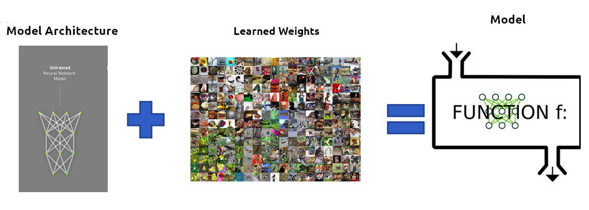
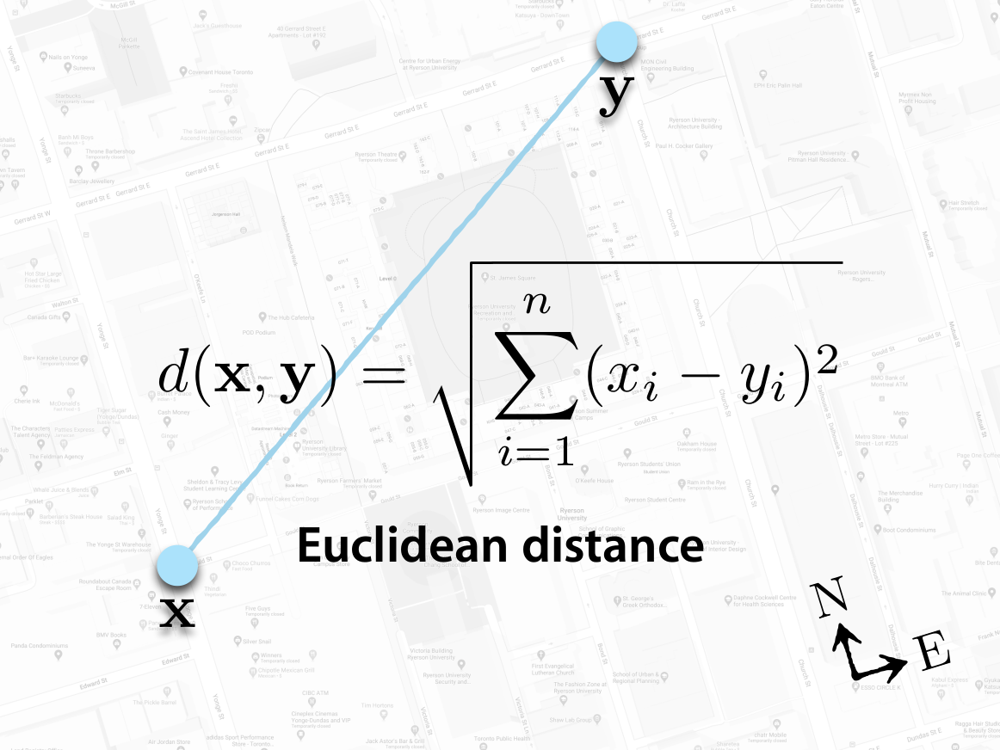
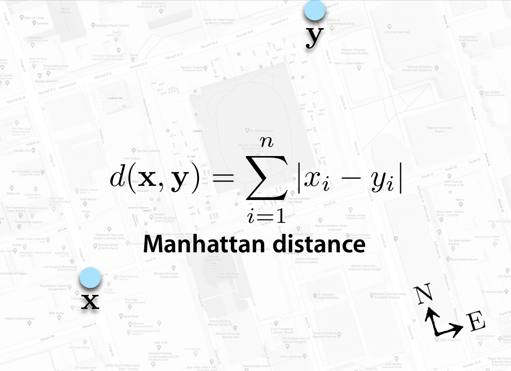
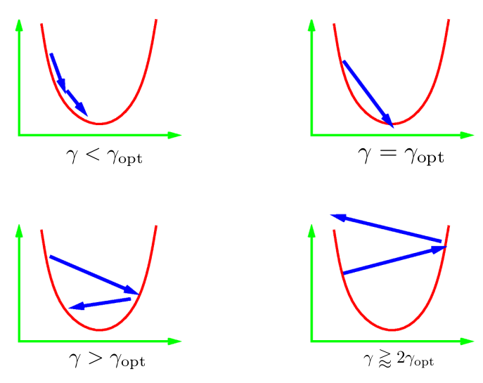
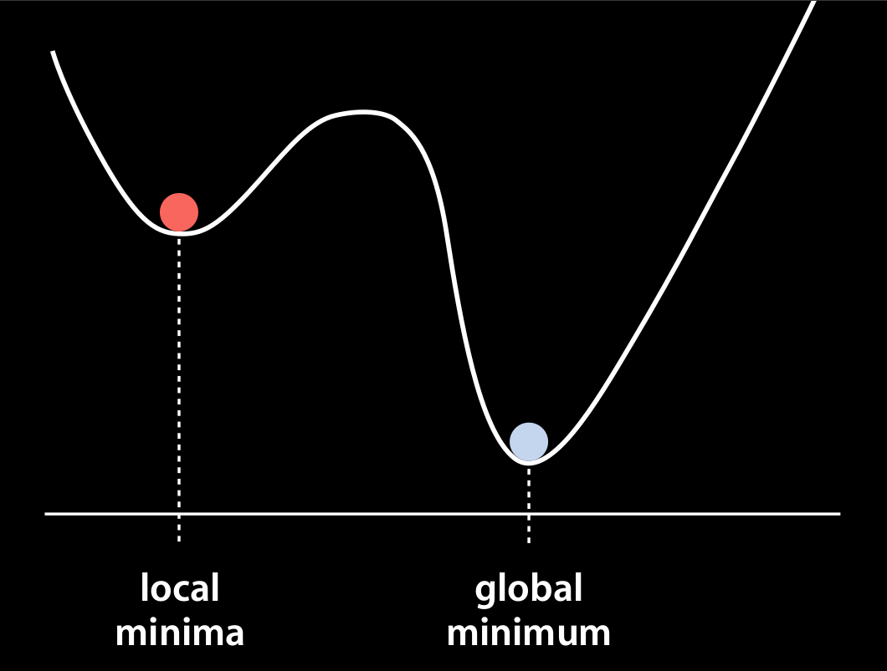

class: middle, center, title-slide
# Нейронні мережі

Лекція 4: Навчання нейронних мереж

  
Кочура Юрій Петрович 
[iuriy.kochura@gmail.com](mailto:iuriy.kochura@gmail.com)  
<a href="https://t.me/y_kochura">@y_kochura</a>  

---

class:  black-slide, 
background-image: url(./figures/lec1/nn.jpg)
background-size: cover

# Сьогодні

.larger-x[ 
Як ефективно оптимізувати параметри?  

🎙️ Пакетний градiєнтний спуск  
🎙️ Стохастичний градiєнтний спуск  
🎙️ Мiнi-пакетний градiєнтний спуск  
🎙️ Iмпульс    
🎙️ Адаптивні методи:   
   &nbsp;&nbsp;&nbsp;AdaGrad   
   &nbsp;&nbsp;&nbsp; RMSProp   
   &nbsp;&nbsp;&nbsp; Adam   

]

---

class: blue-slide, middle, center
count: false

.larger-xx[Оптимізація параметрів]

---

class: middle

# Модель

Хоча те, що знаходиться всередині глибокої нейронної мережі, може бути складним, у своїй основі це просто функції. Вони приймають деякі вхідні дані та генерують деякі результати.

.center.width-30[]

.footnote[Credits: NVIDIA]

---

class: middle

# Компоненти моделі

.center.width-100[]

.footnote[Credits: NVIDIA]

???
Навчена мережа складається з двох компонентів:
- Опис архітектури ненавченої мережі.
- Ваги, які були "вивчені" під час навчання мережі.

---

class: middle

# Загальний процес навчання для нейронних мереж

1. Визначте завдання + зберіть дані
2. Ініціалізуйте параметри
3. Оберіть алгоритм оптимізації
4. Повторіть ці кроки:
.smaller-xx[
    4.1. Пряме пошерення вхідних даних

    4.2 Обчислення цільової функцію витрат]
.smaller-xx[
    4.3 Зворотне поширення: обчисліть градієнти цільової функції втрат відносно параметрів

    4.4 Оновіть кожен параметр за допомогою градієнтів відповідно до алгоритму оптимізації]

???
To build a machine learning algorithm, usually you’d define an architecture (e.g. Logistic regression, Support Vector Machine, Neural Network) and train it to learn parameters. Here is a common training process for neural networks.

Initialization can have a significant impact on convergence in training deep neural networks. Simple initialization schemes have been found to accelerate training, but they require some care to avoid common pitfalls.

Initializing all the weights with zeros leads the neurons to learn the same features during training. 

A too-large initialization leads to exploding gradients. That is, the gradients of the cost with the respect to the parameters are too big. This leads the cost to oscillate around its minimum value.

A too-small initialization leads to vanishing gradients. The gradients of the cost with respect to the parameters are too small, leading to convergence of the cost before it has reached the minimum value.

In machine learning, you start by defining a task and a model. The model consists of an architecture and parameters. For a given architecture, the values of the parameters determine how accurately the model performs the task. But how do you find good values? By defining a loss function that evaluates how well the model performs. The goal is to minimize the loss and thereby to find parameter values that match predictions with reality. This is the essence of training.

---

class: middle

# Загальні функції втрати

- Евклiдова відстань (L2 втрати)
- Середньоквадратична похибка (MSE)
- Манхеттенська відстань (L1 втрати)
- Середня абсолютна похибка(MAE)
- Перехресна втрата ентропiї

???
In mathematical optimization and decision theory, a loss function or cost function is a function that maps an event or values of one or more variables onto a real number intuitively representing some "cost" associated with the event. 

---

class: middle

.width-100[]

.footnote[Slide source: [Deep Learning in Computer Vision ](https://www.cs.ryerson.ca/~kosta/CP8309-F2018/index.html)]

???
It is a distance measure that best can be explained as the length of a segment connecting two points.

---

class: middle

# Евклiдова відстань (L2 втрати)

$$d(\hat y,y) = \sqrt{\sum\_{i=1}^n \left(\hat y^{(i)} - y^{(i)}\right)^2} = \left \Vert \hat y - y \right \Vert\_2$$
де $n$ – загальна кількість навчальних прикладів.

???
Euclidean distance works great when you have low-dimensional data and the magnitude of the vectors is important to be measured.

Although it is a common distance measure, Euclidean distance is not scale in-variant which means that distances computed might be skewed depending on the units of the features. Typically, one needs to normalize the data before using this distance measure.

---

class: middle

# Середньоквадратична похибка (MSE)

$$\begin{aligned}
\mathcal{L}(\hat y^{(i)}, y^{(i)}) &= (\hat y^{(i)} - y^{(i)})^2 \\\\
\mathcal{J}(\hat y,y) &= \frac{1}{n} \sqrt{\sum\_{i=1}^n \left(\hat y^{(i)} - y^{(i)}\right)^2} = \frac{1}{n} \left \Vert \hat y - y \right \Vert\_2
\end{aligned}$$
де $n$ – загальна кількість навчальних прикладів.

---

class: middle

.width-100[]

.footnote[Slide source: [Deep Learning in Computer Vision ](https://www.cs.ryerson.ca/~kosta/CP8309-F2018/index.html)]

---

class: middle

.width-100[]

.footnote[Slide source: [Deep Learning in Computer Vision ](https://www.cs.ryerson.ca/~kosta/CP8309-F2018/index.html)]

???
The Manhattan distance, often called Taxicab distance or City Block distance, calculates the distance between real-valued vectors. 

The distance between two points measured along axes at right angles.

---

class: middle

# Манхеттенська відстань (L1 втрати)

$$d(\hat y,y) = \sum\_{i=1}^n |\hat y^{(i)} - y^{(i)}| = \left \Vert \hat y - y \right \Vert\_1$$
де $n$ – загальна кількість навчальних прикладів.

---

class: middle

# Середня абсолютна похибка(MAE)

$$\begin{aligned}
\mathcal{L}(\hat y^{(i)}, y^{(i)}) &= |\hat y^{(i)} - y^{(i)}| \\\\
\mathcal{J}(\hat y,y) &= \frac{1}{n} \sum_{i=1}^n |\hat y^{(i)} - y^{(i)}| = \frac{1}{n} \left \Vert \hat y - y \right \Vert_1
\end{aligned}$$
де $n$ – загальна кількість навчальних прикладів.

---

class: middle

# Перехресна втрата ентропiї (бінарна)

$$\begin{aligned}
\mathcal{L}(\hat y^{(i)},y^{(i)}) &= - y^{(i)} \log(\hat{y}^{(i)}) + (1 - y^{(i)}) \log(1 - \hat{y}^{(i)}) \\\\
\mathcal{J}(\hat y,y)  &= - \frac{1}{n} \sum\_{i=1}^n \Big[ y^{(i)} \log(\hat{y}^{(i)}) + (1 - y^{(i)}) \log(1 - \hat{y}^{(i)}) \Big]
\end{aligned}$$
де $n$ – загальна кількість навчальних прикладів.

---

class: middle

## 9 метрик відстані в науці про дані

.center.width-70[]

.footnote[Slide source: [9 Distance Measures in Data Science](https://towardsdatascience.com/9-distance-measures-in-data-science-918109d069fa)]

???
Cosine similarity has often been used as a way to counteract Euclidean distance’s problem with high dimensionality. The cosine similarity is simply the cosine of the angle between two vectors.

One main disadvantage of cosine similarity is that the magnitude of vectors is not taken into account, merely their direction. In practice, this means that the differences in values are not fully taken into account. 

We use cosine similarity often when we have high-dimensional data and when the magnitude of the vectors is not of importance. 

Hamming distance is the number of values that are different between two vectors. It is typically used to compare two binary strings of equal length. As you might expect, hamming distance is difficult to use when two vectors are not of equal length.Typical use cases include error correction/detection when data is transmitted over computer networks. It can be used to determine the number of distorted bits in a binary word as a way to estimate error.

Although Manhattan distance seems to work okay for high-dimensional data, it is a measure that is somewhat less intuitive than euclidean distance, especially when using in high-dimensional data. Moreover, it is more likely to give a higher distance value than euclidean distance since it does not the shortest path possible. This does not necessarily give issues but is something you should take into account. When your dataset has discrete and/or binary attributes, Manhattan seems to work quite well since it takes into account the paths that realistically could be taken within values of those attributes. 

Chebyshev distance is defined as the greatest of difference between two vectors along any coordinate dimension. In other words, it is simply the maximum distance along one axis.

The Jaccard index (or Intersection over Union) is a metric used to calculate the similarity and diversity of sample sets. It is the size of the intersection divided by the size of the union of the sample sets.

Haversine distance is the distance between two points on a sphere given their longitudes and latitudes.

The Sørensen-Dice index is very similar to Jaccard index in that it measures the similarity and diversity of sample sets.

---

.width-100[]

.footnote[Slide source: [Deep Learning in Computer Vision ](https://www.cs.ryerson.ca/~kosta/CP8309-F2018/index.html)]

---

class: blue-slide, middle, center
count: false

.larger-xx[Оптимізаційні алгоритми]

---

class: middle

# Гіперпараметри & Параметри

- Результатом оптимізації є набір параметрів
- Гіперпараметри vs. Параметри

.grid[
.kol-1-2[
**Гіперпараметри**
.smaller-xx[
- Коефіцієнт поділу датасету навчання/валідація/тестування
- Швидкість навчання в алгоритмах оптимізації
- Кількість прихованих шарів у НМ
- Кількість блоків активації в кожному шарі
- Розмір пакету

.center[$\vdots$]
]]
.kol-1-2[
**Параметри**
.smaller-xx[
- Ваги та зсуви НМ
- Центроїди кластерів у кластеризації
]]]

.footnote[Credits:: [Kizito Nyuytiymbiy](https://towardsdatascience.com/parameters-and-hyperparameters-aa609601a9ac)]

???
Hyperparameters are parameters whose values control the learning process and determine the values of model parameters that a learning algorithm ends up learning. The prefix ‘hyper_’ suggests that they are ‘top-level’ parameters that control the learning process and the model parameters that result from it.

Parameters on the other hand are internal to the model. That is, they are learned or estimated purely from the data during training as the algorithm used tries to learn the mapping between the input features and the labels or targets.

---

class: middle

# Задача оптимізації

## Мінімізація емпіричного ризику (втрат)

$$W\_\*^\{\mathbf{d}} = \arg \min\_W \mathcal{J}(W) = \arg \min\_W \frac{1}{n} \sum\_{i=1}^n \mathcal{L}\left(y^{(i)}, f(\mathbf{x}^{(i)}, W)\right)$$

---

class: black-slide

.width-100[]

.footnote[Slide source: [Deep Learning in Computer Vision ](https://www.cs.ryerson.ca/~kosta/CP8309-F2018/index.html)]

---

class: middle

## Практичні рекомендації

Навчання масивної глибокої нейронної мережі є тривалим та складним процесом.

Першим кроком до розуміння, налагодження та оптимізації нейронних мереж є використання інструментів візуалізації:

- побудова графіків втрат та інших метрик продуктивності,
- візуалізація обчислювальних графіків,
- показ додаткових даних під час навчання мережі.

---

background-image: url(figures/lec4/tensorboard.png)

???
TensorBoard provides the visualization and tooling needed for machine learning experimentation: 
- Tracking and visualizing metrics such as loss and accuracy
- Visualizing the model graph (ops and layers)
- Viewing histograms of weights, biases, or other tensors as they change over time
- Projecting embeddings to a lower dimensional space
- Displaying images, text, and audio data
- Profiling TensorFlow programs

---

class: middle, center

.larger-xx[[Демо](https://www.google.com/url?sa=t&rct=j&q=&esrc=s&source=web&cd=&cad=rja&uact=8&ved=2ahUKEwjYtYasjvnzAhUPCewKHYANDggQFnoECAQQAQ&url=https%3A%2F%2Fcolab.research.google.com%2Fgithub%2Ftensorflow%2Ftensorboard%2Fblob%2Fmaster%2Fdocs%2Ftensorboard_in_notebooks.ipynb&usg=AOvVaw1vAk6hbwao2KtXBNnZ1cez)]

---

class: blue-slide, middle, center
count: false

.larger-xx[Пакетний градiєнтний спуск 

GD]

---

class: middle

# Пакетний градiєнтний спуск

Щоб мінімізувати $\mathcal{J}(W)$, 
**пакетний градієнтний спуск** (GD) використовує наступне правило:
$$\begin{aligned}
g\_t &= \frac{1}{n} \sum\_{i=1}^n \nabla\_W \mathcal{L}\left(y^{(i)}, f(\mathbf{x}^{(i)}, W)\right) = \nabla\_W \mathcal{J}(W)\\\\
W\_{t+1} &= W\_t - \alpha g\_t,
\end{aligned}$$
дек $\alpha$ &mdash; крок навчання.
.center.width-60[]

---

class: middle

# GD

.larger-x[Найгірший метод оптимізації в світі]

.alert[Примітка: ймовірно, Вам ніколи не слід використовувати градієнтний спуск безпосередньо, вважайте це будівельним блоком для інших методів.]

.footnote[Credits: Aaron Defazio, Facebook AI Research]

---

class: middle

# Крок навчання

.center.width-70[]

Тут $\gamma = \alpha$ &mdash; крок навчання.

.footnote[Credits: Aaron Defazio, Facebook AI Research]

???
The learning rate $\gamma = \alpha$ can be set by the algorithm designer. If we use a learning rate that is too small, it will cause $W$ to update very slowly, requiring more iterations to get a better solution.

Typically we don't have a good estimate of the learning rate. Standard practice is to try a bunch of values on a log scale and use the one that gave the best final result.

Learning rates that are too large cause divergence where the function value (loss) explodes.

The optimal learning rate can change during optimization! Often decreasing it over time is necessary.

---

class: black-slide

.width-100[]

.footnote[Slide source: [Deep Learning in Computer Vision ](https://www.cs.ryerson.ca/~kosta/CP8309-F2018/index.html)]

???
The empirical risk is an average loss on the training dataset while the risk is the expected loss on the entire population of data.

There are many challenges in deep learning optimization. Some of the most vexing ones are local minima, saddle points, and vanishing gradients.

---

class: black-slide

.width-100[]

.footnote[Slide source: [Deep Learning in Computer Vision ](https://www.cs.ryerson.ca/~kosta/CP8309-F2018/index.html)]

???
For any objective function $\mathcal{J}(W)$, if the value of $\mathcal{J}(W)$ at $W$ is smaller than the values of $W$ at any other points in the vicinity of $W$, then $\mathcal{J}(W)$ could be a local minimum. If the value of $\mathcal{J}(W)$ at $W$ is the minimum of the objective function over the entire domain, then $\mathcal{J}(W)$ is the global minimum.

---

class: black-slide, middle

.center[
<video loop controls preload="auto" height="600" width="600">
  <source src="./figures/lec4/follow-slope.mp4" type="video/mp4">
</video>
]

.footnote[Slide source: [Gradient descent, how neural networks learn](https://www.3blue1brown.com/lessons/gradient-descent)]

---

class: black-slide, middle

.center[
<video loop controls preload="auto" height="600" width="600">
  <source src="./figures/lec4/balls-rolling-down.mp4" type="video/mp4">
</video>
]

.footnote[Slide source: [Gradient descent, how neural networks learn](https://www.3blue1brown.com/lessons/gradient-descent)]

---

class: middle

.center[
<video loop controls preload="auto" height="600" width="600">
  <source src="./figures/lec4/opt-gd.mp4" type="video/mp4">
</video>
]

---

class: blue-slide, middle, center
count: false

.larger-xx[Cтохастичний градiєнтний спуск 

SGD]

---

class: middle

# SGD

Щоб зменшити обчислювальну складність, **стохастичний градієнтний спуск** (SGD) полягає в оновленні параметрів після кожного прикладу
$$\begin{aligned}
\ell^{(i)} &= \mathcal{L}\left(y^{(i)}, f(\mathbf{x}^{(i)}, W)\right) \\\\
g^{(i)}\_t &= \nabla\_W \ell^{(i)} \\\\
W\_{t+1} &= W\_t - \alpha g^{(i)}\_t
\end{aligned}$$

???
In deep learning, the objective function is usually the average of the loss functions for each example in the training dataset. Given a training dataset of $n$ examples, we assume that $\ell^{(i)}$ is the loss function with respect to the training example of index $i$, where $W$ is the parameter vector.

---

class: middle

# Переваги SGD

- Стохастичні градієнти обчислювати значно легше (пропорційно розміру набору даних), тому Ви часто можете зробити тисячі кроків SGD за вартість одного кроку GD.

- У середньому стохастичний градієнт є хорошою оцінкою градієнта.

- Шум може перешкоджати оптимізаційному сходженню до поганих локальних мінімумів.
.footnote[Credits: Aaron Defazio, Facebook AI Research]

---

class: blue-slide, middle, center
count: false

.larger-xx[Міні-пакети]

---

class: middle

# Міні-пакети

Обчислення втрат для міні-пакетів та оновлення параметрів
$$
\begin{aligned}
g^{(k)}\_t &= \frac{1}{B} \sum\_{i=1}^B \nabla\_W \mathcal{L}\left(y\_k^{(i)}, f(\mathbf{x}\_k^{(i)}, W)\right) \\\\
W\_{t+1} &= W\_t - \alpha g^{(k)}\_t,
\end{aligned}
$$
де $k$ &mdash; індекс міні-пакета.

- Збільшення розміру пакету $B$ зменшує дисперсію оцінок градієнта та забезпечує прискорення пакетної обробки.
- Взаємозв'язок між $B$ і $\alpha$ все ще незрозумілий.

---

class: blue-slide, middle, center
count: false

.larger-xx[Імпульс]

---

class: middle

# Імпульс

SGD + Імпульс = Стохастичний метод *важкої кулі*

$$
\begin{aligned}
p\_{t + 1} &= \beta\_t p\_{t} + \nabla \ell^{(i)} (W\_t)\\\\
W\_{t+1} &= W\_t - \alpha\_t p\_{t + 1}
\end{aligned}
$$

Правило оновлення:

$$
\begin{aligned}
W\_{t+1} &= W\_t - \alpha\_t \nabla \ell^{(i)} (W\_t) + \beta\_t \left(W\_{t} - W\_{t-1}\right)
\end{aligned}
$$

**Ключова ідея:** Наступний крок стає комбінацією напрямку попереднього кроку та нового негативного градієнта.

???
Momentum replaces gradients with a leaky average over past gradients. This accelerates convergence significantly. Momentum usually speeds up the learning with a very minor implementation change. 

---

<iframe class="iframemomentum" src="https://distill.pub/2017/momentum/" scrolling="no" frameborder="no"  style="position:absolute; top:-165px; left: -25px; width:950px; height: 600px"></iframe>

.footnote[Credits:  Distill, [Why Momentum Really Works?](https://distill.pub/2017/momentum/)]

???
**Intuition.** The optimization process resembles a **heavy ball** rolling down a hill. The ball has **momentum**, so it doesn’t change direction immediately when it encounters changes to the landscape!

---

class: middle, black-slide

.center[
<video loop controls preload="auto" height="500" width="600">
  <source src="./figures/lec4/sgd-momentum.mp4" type="video/mp4">
</video>
]

.footnote[Image credits: Kosta Derpanis, [Deep Learning in Computer Vision](https://www.cs.ryerson.ca/~kosta/CP8309-F2018/index.html), 2018]

---

class: middle

# Переваги

SGD з імпульсом має **три** хороші властивості:
- він може пройти через локальні бар'єри
- прискорюється, якщо градієнт не сильно змінюється
- гасить коливання у вузьких долинах

---

class: middle

## Практичні аспекти імпульсу

По суті, це **«безкоштовний обід»**, майже в усіх ситуаціях **SGD + імпульс** краще, ніж SGD, і дуже рідко гірше!

## Рекомендовані параметри:

$\beta = 0.9$ or $0.99$ майже завжди працють добре. Іноді можна отримати невеликі переваги, налаштувавши його.

Параметр розміру кроку ($\alpha$) зазвичай потрібно зменшувати, коли параметр імпульсу збільшується, щоб підтримувати збіжність.

.footnote[Credits: Aaron Defazio, Facebook AI Research]

---

class: middle, center

.larger-xx[[Демо](https://www.deeplearning.ai/ai-notes/optimization/)]

---

class: blue-slide, middle, center
count: false

.larger-xx[Адаптивні методи]

---

class: middle

# Адаптивні методи  

Величина градієнтів часто сильно відрізняється між шарами, тому глобальна швидкість навчання може не працювати належним чином.

*Загальна ідея:* Замість того, щоб використовувати однакову швидкість навчання для кожної ваги в нашій мережі, **підтримуйте оцінку кращої швидкості окремо для кожної ваги**.

Точний спосіб адаптації до швидкості навчання залежить від алгоритму, але більшість методів або **пристосовуються** до **дисперсії ваг**, або до **локальної кривизни** проблеми.

.footnote[Credits: Aaron Defazio, Facebook AI Research]

---

class: middle

## AdaGrad

Зменшення масштабу для кожного параметра на квадратний корінь із суми квадратів усіх його історичних значень.

$$\begin{aligned}
r\_t  &=  r\_{t-1} + g\_t \odot g\_t \\\\
W\_{t+1} &= W\_t - \frac{\alpha}{\varepsilon + \sqrt{r\_t}} \odot g\_t
\end{aligned}$$

- AdaGrad позбавляє від необхідності вручну налаштовувати швидкість навчання.
  Більшість реалізацій використовують $\alpha=0.01$ за замовчуванням.
- Добре, коли цільова функція опукла.
- $r_t$ необмежено зростає під час навчання, що може спричинити зменшення розміру кроку та зрештою стати нескінченно малим.
- $\varepsilon$ адитивна константа, яка гарантує, що ми не ділимо на 0.

???
The variable $r\_t$ accumulates past gradient variance.

---

class: middle

## RMSProp

Те саме, що AdaGrad, але накопичує експоненціально спадне середнє значення градієнта.

**Ключова ідея:** нормалізувати за середньоквадратичним значенням градієнта

$$\begin{aligned}
r\_t  &=  \rho r\_{t-1} + (1-\rho) g\_t \odot g\_t \\\\
W\_{t+1} &= W\_t - \frac{\alpha}{\varepsilon + \sqrt{r\_t}} \odot g\_t
\end{aligned}$$

- Ефективніший, коли цільова функція не є опуклою.

???
An alternative is to use a leaky average in the same way we used in the momentum method, for some parameter $\rho>0$.

---

class: middle

## Adam: RMSprop з імпульсом

.smaller-xx[“Adaptive Moment Estimation”]

Подібно до RMSProp з імпульсом, але з умовами корекції зсуву для першого та другого моментів.

$$\begin{aligned}
p\_t  &=  \rho\_1 p\_{t-1} + (1-\rho\_1) g\_t \\\\
\hat{p}\_t &= \frac{p\_t}{1-\rho\_1^t} \\\\
r\_t  &=  \rho\_2 r\_{t-1} + (1-\rho\_2) g\_t \odot g\_t \\\\
\hat{r}\_t &= \frac{r\_t}{1-\rho\_2^t} \\\\
W\_{t+1} &= W\_t - \alpha \frac{\hat{p}\_t}{\varepsilon+\sqrt{\hat{r}\_t}}
\end{aligned}$$

- Хороші значення за замовчуванням $\rho\_1=0.9$ і $\rho\_2=0.999$.
- Подібно до того, як імпульс покращує SGD, він також покращує RMSProp.

???
Adam is one of the **default optimizers** in deep learning, along with SGD with momentum.

---

# Практична сторона

Для погано обумовлених задач Adam часто набагато кращий, ніж SGD.

Використовуйте Adam замість RMSprop завдяки очевидним перевагам імпульсу.

## Але, Adam погано вивчений теоретично та має відомі недоліки::

- Зовсім не сходиться на деяких простих прикладах задач!
- Дає гіршу помилку узагальнення для багатьох задач комп’ютерного зору (наприклад, ImageNet)
- Потрібно більше пам'яті, ніж SGD
- Має 2 параметри моментів, тому може знадобитися деяке налаштування

.footnote[Credits: Aaron Defazio, Facebook AI Research]

---

class: middle, center

.larger-xx[[Демо](https://www.deeplearning.ai/ai-notes/optimization/)]

---

class: middle, center

.larger-xx[[demo - losslandscape](https://losslandscape.com/explorer)]

---

class: end-slide, center
count: false

.larger-xxxx[🏁]

